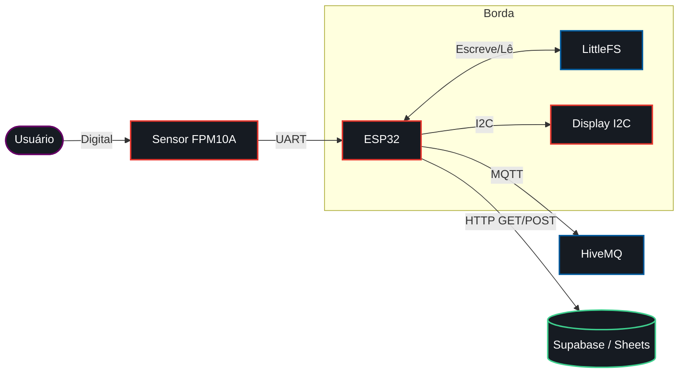

# Sistema de Presença Biométrico


## O Problema
O controle de presença físico exige uma máquina dedicada ou folhas de papel na bancada do laboratório. Professores e gestores perdem tempo consolidando assinaturas, e as planilhas manuais geram divergências de dados. O dispositivo resolve isso automatizando a coleta direto no ponto de acesso.

## Decisões de Arquitetura e Trade-offs

### Fila em Flash (LittleFS)
A rede Wi-Fi oscila em ambientes corporativos e acadêmicos. O firmware grava as biometrias validadas na memória Flash interna do ESP32 (LittleFS) antes do despacho de rede. Quando a conexão cai, os registros acumulam localmente. O sistema retransmite a fila acumulada em lote quando a rede volta, o que impede a perda de dados por queda de sinal.

### Protocolo Híbrido
O projeto divide a carga de rede em duas vias. O MQTT trafega telemetria e feedback visual imediato no display. Requisições HTTP REST gravam a presença final no banco de dados relacional (Supabase) ou em planilhas (Google Sheets). Isso separa o status da máquina do armazenamento primário.

### Máquina de Estados Não Bloqueante
O sensor biométrico (AS608/FPM10A) responde via interface UART. O laço de repetição roda uma máquina de estados finitos que avalia os bytes na porta serial. A substituição da função padrão de atraso pelo cálculo de milissegundos mantém o WebServer embutido e a fila MQTT responsivos enquanto o usuário posiciona o dedo no leitor.

## Fluxo de Dados



## Diário de Bancada

**Ruído UART:** O tempo de resposta do sensor causava perda de pacotes na comunicação serial. O cabo dos pinos RX/TX precisou ser encurtado, e a fixação da taxa de transferência em 57600 bps eliminou a corrupção na transferência da matriz biométrica.

**Consumo de RAM no JSON:** A conversão de pacotes MQTT para objetos C++ com ArduinoJson causava fragmentação de memória. Alocar o documento JSON de forma estática conteve o vazamento na placa.

**Handshake Óptico:** O leitor exige duas capturas da mesma digital para compilar o modelo. O usuário costuma tirar o dedo rápido demais. Inserir avisos intermediários no display resolveu a falha de captura.

## Limitações Conhecidas e Próximos Passos
O circuito atual depende do protocolo NTP para registrar o horário do ponto na nuvem. A falta de um relógio de tempo real (RTC) externo impede medições precisas quando o dispositivo inicia offline. O prisma de vidro do leitor óptico satura sob luz solar direta. A confecção de um case protetor impresso em 3D cobrindo as laterais do sensor está no roteiro das próximas revisões.

## Montagem e Configuração

Conecte os componentes:

| Componente | Pino Físico | Pino ESP32 | Função |
| :--- | :--- | :--- | :--- |
| **Sensor FPM10A** | TX | GPIO 16 (RX2) | UART RX |
| **Sensor FPM10A** | RX | GPIO 17 (TX2) | UART TX |
| **Sensor FPM10A** | VCC | 3.3V / 5V | Alimentação |
| **Display I2C** | SDA | GPIO 21 | Dados I2C |
| **Display I2C** | SCL | GPIO 22 | Clock I2C |
| **Ambos** | GND | GND | Aterramento |

Na IDE do Arduino, instale as bibliotecas `Adafruit Fingerprint Sensor Library`, `Grove - LCD RGB Backlight`, `PubSubClient` e `ArduinoJson`.

Preencha as credenciais da rede no arquivo `projeto-sensor.ino` ou isole as constantes em um arquivo de configuração `config.h`:
```cpp
const char* ssid = "SEU_WIFI_AQUI";
const char* password = "SUA_SENHA_AQUI";
```

### Setup do Ambiente Cloud

O projeto suporta dois provedores de persistência. Configure o backend de sua preferência:

**Opção A: Google Sheets**
1. Crie uma nova planilha no Google Sheets.
2. Acesse as extensões do Apps Script e adicione a lógica de cadastro (ex: recepção de parâmetros GET).
3. Realize o deploy como Web App com acesso público.
4. Insira a URL gerada na variável `googleScriptURL` no firmware.
5. Utilize a página estática correspondente para administração (`frontend_google_sheets.html`).

**Opção B: Supabase**
1. Crie um projeto no Supabase e defina a tabela `alunos` ou `presencas`.
2. Colete a `Project URL` e a `Anon Key` no painel da API.
3. Insira essas chaves diretamente no script JavaScript da página de administração local.
4. Utilize a página estática correspondente (`frontend_supabase.html`) hospedada localmente ou em uma CDN.

Compile o código definindo o esquema de partição com espaço para o sistema de arquivos Flash (LittleFS).

## Estrutura do Repositório

```text
projeto-sensor/
├── projeto-sensor.ino          # Firmware principal com a lógica Offline e WebServer
├── site.h                      # Conversão do HTML em C-string (PROGMEM) para injeção
├── examples/
│   ├── exemplo_mqtt_com_app/   # Código alternativo integrando broker MQTT e App
│   ├── exemplo_mqtt_simples/   # Teste básico isolado do client MQTT
│   └── exemplo_sensor_basico/  # Script puro de aferição de hardware do sensor
└── frontend/
    ├── frontend_google_sheets.html # Painel focado na integração com Apps Script
    └── frontend_supabase.html      # SPA configurado para chamadas diretas ao Supabase
```