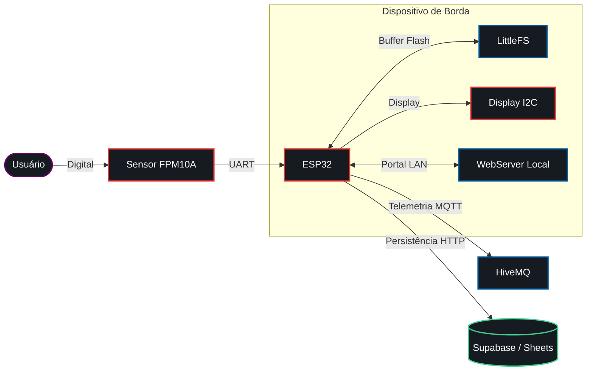

# Sistema de Presença Biométrico


## Contexto e O Problema Real
O controle de presença em laboratórios e salas de aula exige uma máquina dedicada operando como ponto escravo ou o uso de folhas de papel na bancada. O hardware foi construído para eliminar a necessidade do computador, automatizando a coleta direto no ponto de acesso e descartando as listas manuais que geram divergências nos dados de frequência.

## Decisões de Engenharia e Trade-offs

### Fila Offline com LittleFS
A conectividade Wi-Fi oscila em infraestruturas corporativas e acadêmicas. O firmware bufferiza as biometrias validadas na memória Flash interna do ESP32 através do sistema de arquivos LittleFS. Durante quedas de rede, os dados ficam retidos localmente; quando a conexão retorna, o sistema descarrega a fila em lote. Esse trade-off garante tolerância a falhas sem hardware de armazenamento adicional.

### Protocolo Híbrido
O sistema separa as rotas de dados conforme a latência exigida. O protocolo MQTT trata a telemetria em tempo real e entrega feedback visual de estado no display. O tráfego de persistência primária opera via HTTP REST em background, enviando os dados consolidados para o banco relacional (Supabase) ou planilhas (Google Sheets).

### Máquina de Estados Não Bloqueante
O sensor FPM10A exige tempo para capturar e comparar o mapa da digital via interface UART. O código de leitura foi estruturado como uma máquina de estados finitos dentro do `loop()`, eliminando o uso de `delay()`. O processamento assíncrono impede que a porta serial congele o WebServer embutido.

### Portal Web Local (site.h)
O dispositivo carrega um portal de configuração HTML/JS servido direto da memória de programa (PROGMEM). A interface expõe formulários de cadastro na rede de área local (WLAN) sob o IP do ESP32, descartando o desenvolvimento de aplicativos nativos auxiliares para a operação de cadastro.

## Fluxo de Integração



## Diário de Bancada

**Ruído UART:** O tempo de processamento longo do sensor resultou em frames de pacotes truncados na serial. O problema exigiu a redução do tamanho dos cabos entre o módulo e o ESP32, e a fixação da *baud rate* da UART2 em 57600 bps eliminou a corrupção do buffer.

**Consumo de RAM no JSON:** A serialização dinâmica de pacotes MQTT causou *heap fragmentation* crítica em tempo de execução. O firmware conteve o vazamento migrando para a declaração estática de documentos do `ArduinoJson` pré-alocados em memória.

**Saturação Solar Óptica:** A luz ambiente direta afeta o prisma de leitura óptico. A reflexão corrompe o handshake entre as duas leituras obrigatórias da digital para criação do modelo biométrico.

**Compensação de Tempo:** A falta de um RTC físico impede medições corretas de timestamp nativo se o hardware for ligado offline. O código compensa buscando a hora por NTP assim que obtém endereço IP, mas os *timestamps* iniciais em estado desconectado perdem sincronismo exato.

## Hardware e Pinagem

Conecte os periféricos à placa controladora:

| Componente | Pino Físico | Pino ESP32 | Função |
| :--- | :--- | :--- | :--- |
| **Sensor FPM10A** | TX | GPIO 16 (RX2) | UART RX |
| **Sensor FPM10A** | RX | GPIO 17 (TX2) | UART TX |
| **Sensor FPM10A** | VCC | 3.3V / 5V | Alimentação |
| **Display I2C** | SDA | GPIO 21 | Dados I2C |
| **Display I2C** | SCL | GPIO 22 | Clock I2C |
| **Ambos** | GND | GND | Aterramento comum |

## Estrutura do Repositório

```text
projeto-sensor/
├── projeto-sensor.ino          # Firmware principal com máquina de estados, Offline Queue e WebServer
├── site.h                      # Portal local convertido em C-string
├── examples/                   # Códigos para validação individual de hardware e protocolo
│   ├── exemplo_mqtt_com_app/
│   ├── exemplo_mqtt_simples/
│   └── exemplo_sensor_basico/
└── frontend/                   # Interfaces SPA estáticas para integração externa
    ├── frontend_google_sheets.html
    └── frontend_supabase.html
```

## Guia de Configuração e Nuvem

Instale os pré-requisitos na Arduino IDE: `Adafruit Fingerprint Sensor Library`, `Grove - LCD RGB Backlight`, `PubSubClient` e `ArduinoJson`.

### Configuração do Firmware
1. Defina o SSID e a senha do Wi-Fi em `projeto-sensor.ino`.
2. Configure o esquema de partição na IDE com reserva para armazenamento de arquivos (ex: *Default 4MB with spiffs/LittleFS*).
3. Flasheie a placa e observe o IP designado pelo roteador no Monitor Serial.

### Setup Opção A: Google Sheets
1. Crie uma planilha em branco.
2. Inicie o Google Apps Script e defina funções `doGet(e)` e `doPost(e)` para iterar as matrizes da planilha e inserir a linha com o ID retornado pelo ESP32.
3. Implante o projeto como um Web App e libere a permissão de acesso para acesso de "Qualquer pessoa".
4. Cole a URL fornecida na constante `googleScriptURL` do firmware.

### Setup Opção B: Supabase
1. Crie o projeto na dashboard do Supabase e gere a tabela com as colunas primárias (id, matricula, timestamp).
2. Copie a `Project URL` e a `Anon Key` da aba de configurações de API.
3. Cole as strings no bloco de inicialização do JavaScript no arquivo `frontend/frontend_supabase.html`.
4. Hospede a interface em uma CDN ou em um Storage estático local.

## Limitações e Próximos Passos
* Implementar um módulo RTC DS3231 I2C dedicado para rastrear offline *timestamps* puros independente de conexão NTP prévia.
* Fabricar um case em impressora 3D com formato em abajur (sombreamento óptico) ao redor do prisma biométrico, mitigando interferências da luz do sol na detecção de cumes de digitais.